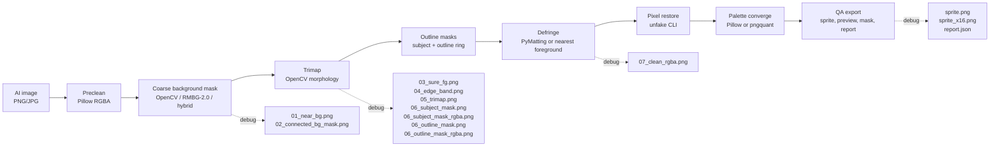

# Perfect Pixel Workflow

## Reuse Map

| Stage | Reuse | Purpose |
| --- | --- | --- |
| Input normalization | Pillow | Read/write PNG and convert RGBA |
| Coarse background mask | OpenCV / RMBG-2.0 | Connected components, RMBG alpha matte, hybrid fusion, morphology |
| Outline masks | OpenCV | Export solid subject mask and dilated outline-ring mask |
| Defringe | PyMatting / scipy | Remove white matte color contamination around edges |
| Pixel restore | unfake CLI | Scale detection, grid snap, dominant/content-adaptive downscale |
| Palette converge | Pillow / pngquant | Reduce colors without dithering |
| QA export | Pillow / JSON | Nearest-neighbor preview and metadata |

This same pipeline powers both `perfect-pixel run` and `perfect-pixel web`.
